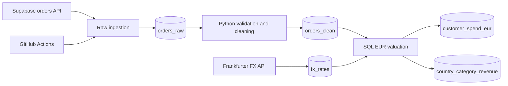

# Aqurate Data Engineering Take-Home

## Overview

A small, rerunnable Python + SQL pipeline that ingests the supplied Supabase order-line feed, persists a faithful raw representation, materialises cleaned order lines, retrieves FX observations from Frankfurter, and refreshes two EUR reporting tables daily.

SQLite is the no-setup local database. Set `DATABASE_URL` to use PostgreSQL (including Supabase) instead; the scheduled GitHub Actions run uses this persistent mode so each daily refresh is retained and queryable.



## Quick Start

Python 3.11+ is required.

```powershell
python -m venv .venv
.venv\Scripts\Activate.ps1
pip install -r requirements.txt
Copy-Item .env.example .env
# Add the assignment API key to ORDERS_SOURCE_API_KEY in .env
python run_pipeline.py
python -m pytest -q
```

The local database is written to `data/aqurate.db` and is intentionally git-ignored. To inspect results:

```sql
SELECT * FROM customer_spend_eur ORDER BY total_spend_eur DESC;
SELECT * FROM country_category_revenue ORDER BY revenue_rank;
SELECT * FROM pipeline_runs ORDER BY started_at DESC;
```

To inspect the source without writing a database:

```powershell
python run_pipeline.py --data-quality-report
```

## Configuration

`ORDERS_SOURCE_URL` and `ORDERS_SOURCE_API_KEY` must be supplied through environment variables or a local `.env` file. Neither is committed. `DATABASE_PATH` defaults to `data/aqurate.db`; `DATABASE_URL` is optional and, when supplied, selects PostgreSQL instead of SQLite. `FX_API_URL` defaults to Frankfurter; `HTTP_TIMEOUT_SECONDS` defaults to 30.

### Persistent Supabase database

For the scheduled workflow, create a Supabase project and copy a PostgreSQL connection string from its **Connect** panel (the pooled connection string is suitable for GitHub Actions). Add it to the repository's Actions secrets as `SUPABASE_DATABASE_URL`, alongside the existing `ORDERS_SOURCE_URL` and `ORDERS_SOURCE_API_KEY` secrets. Do not commit or publish this connection string.

The first successful scheduled or manually dispatched run creates the tables automatically. Subsequent runs retain `orders_raw`, `fx_rates`, the two output tables, and `pipeline_runs`, so the FX-driven refresh is inspectable over time in Supabase's SQL editor:

```sql
SELECT * FROM customer_spend_eur ORDER BY total_spend_eur DESC;
SELECT * FROM country_category_revenue ORDER BY revenue_rank;
SELECT * FROM pipeline_runs ORDER BY started_at DESC;
```

Local development remains SQLite-only unless `DATABASE_URL` is set. This keeps `pytest` and a first run no-setup while making the deployed automation persistent.

## Pipeline and Idempotency

Each run fetches the complete static source, hashes a canonical JSON representation of each row, and inserts it with `ON CONFLICT DO NOTHING`. Exact duplicate source records therefore do not multiply on a rerun. Repeated `order_id` values are deliberately **not** deduplicated because the source is an order-line feed: one order can legitimately contain several SKUs.

Cleaning creates physical `orders_clean` and `rejected_orders` tables in a transaction. Reporting tables are then rebuilt atomically from SQL. A run audit record captures row counts, FX additions, missing-rate count, start/end times, and a failure message. Failed runs propagate a non-zero exit code.

## Data Quality Findings (live source inspected 2026-08-25)

The compact report found 9,268 source lines and 183 exact duplicate rows. There were 3,237 repeated order-id occurrences, which correspond to line groups rather than evidence of duplicate orders. Other observed issues were:

- 79 null categories (73 remain after exact-row de-duplication and are rejected).
- 103 missing customer IDs. Valid lines remain in `orders_clean` but cannot appear in customer spend.
- 167 invalid quantities, 403 refunded lines, 101 test lines, and 13 `999999` unit-price outliers after de-duplication; these are quarantined with a reason. The next-highest observed valid price was €207.87, so the 10,000 cutoff is deliberately conservative and prevents a clear sentinel value from dominating results.
- `order_ts` appears in ISO timestamp, `DD/MM/YYYY HH:MM`, and Unix-seconds formats; all three are parsed explicitly.
- Both EUR and RON occur. Countries are `BG`, `DE`, `HU`, and `RO`.
- 6,865 FX reference dates were future-dated at inspection time. This is intentional and is not a cleaning error.
- Zero-value lines are retained as valid transactions (with a cleaning note) because zero price is not intrinsically corrupt and their impact is transparent.

Safe whitespace/case/alias normalisation is applied to order ID, category, currency, and country. Negative values, invalid numerical values, unsupported categorical values, missing order IDs, and non-completed statuses are not invented or silently dropped: they go to `rejected_orders`.

## FX Conversion Logic

Rates are stored as `1 source currency = X EUR`. EUR lines use `1.0` without an external request. For RON, the pipeline requests one date range per currency (not one request per order), stores observations with an upsert, and refreshes only through the earlier of the source’s maximum reference date and today.

The analytical SQL chooses `MAX(rate_date) <= fx_reference_date`. This handles weekends, holidays, and dates whose rates have not been published. For future reference dates it therefore uses the latest actually published observation available at runtime—never a future observation—so values may update on a later daily run without look-ahead bias. Lines lacking a usable rate remain visible in `order_values_eur` with a null EUR value and are logged/audited rather than fabricated.

`orders_clean.unit_price`, line values, and FX rates use `NUMERIC` declarations. SQLite has dynamic numeric type affinity; PostgreSQL preserves these values as exact numeric values until the final `ROUND(..., 2)` used in published outputs.

## Outputs

`customer_spend_eur` is `SUM(amount_eur)` by non-null customer ID. `country_category_revenue` contains Books and Electronics only, has a strict `> 40000` EUR filter, and uses `RANK()` descending (ties share rank).

## Daily Automation

`.github/workflows/daily_pipeline.yml` supports manual dispatch and a 02:15 UTC daily schedule (05:15 Romania summer time). It installs dependencies and runs `python run_pipeline.py`, failing visibly on any source, database, validation, or FX error. It uses the `SUPABASE_DATABASE_URL` Actions secret as `DATABASE_URL` and sets `REQUIRE_DATABASE_URL=true`, so a missing secret cannot silently fall back to the runner's ephemeral SQLite disk.

## Monitoring and Silent-Failure Detection

The pipeline logs start/end, raw/clean/rejected counts, FX range/currencies, missing FX orders, output rows, elapsed time, and errors. `pipeline_runs` is the in-database execution record. Built-in checks ensure non-empty raw/clean/customer tables, non-null customer totals, strict revenue threshold, and descending ranks.

In production, alert on failed scheduler jobs **and** run an independent freshness monitor that checks `MAX(completed_at)` for successful `pipeline_runs` against a daily SLA. This catches a disabled schedule, lost webhook, or stalled worker even when the pipeline never starts. Add row-count anomaly alerts, rejected-row rate alerts, output freshness checks, and FX freshness/coverage metrics to the same monitoring system.

## Tests

The offline test suite covers whitespace/case normalisation, invalid numerical fields, null-customer treatment, exact/weekend/latest-prior FX matching, future-date no-look-ahead behavior, EUR identity conversion, customer aggregation, category filtering, threshold strictness, and ranking. External APIs are not called by unit tests.

## AI Usage

An AI coding assistant was used for scaffolding, code review, SQL/query suggestions, test-case generation, and documentation editing. All retained output was checked against the live source, API response shape, SQL semantics, monetary conversion rules, and automated tests.

Examples changed or rejected during review: exact-date-only FX joins were changed to latest-prior-date matching; binary float was not used for Python monetary parsing (`Decimal` is used); blind `order_id` deduplication was rejected because an order has multiple lines; future dates were not classified as invalid and are protected from look-ahead; and the database layer was kept deliberately small while supporting both local SQLite and the persistent PostgreSQL target used by automation.

## Repository Structure

```text
src/       pipeline modules
sql/       schema and SQL transformations
tests/     offline business-rule tests
.github/   daily workflow
run_pipeline.py
```
